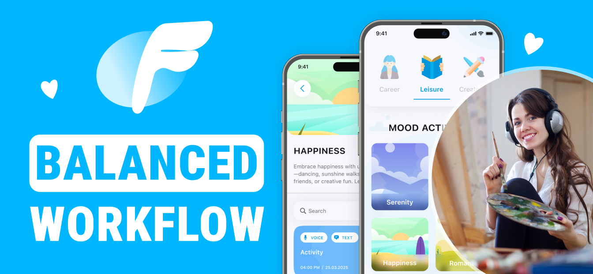
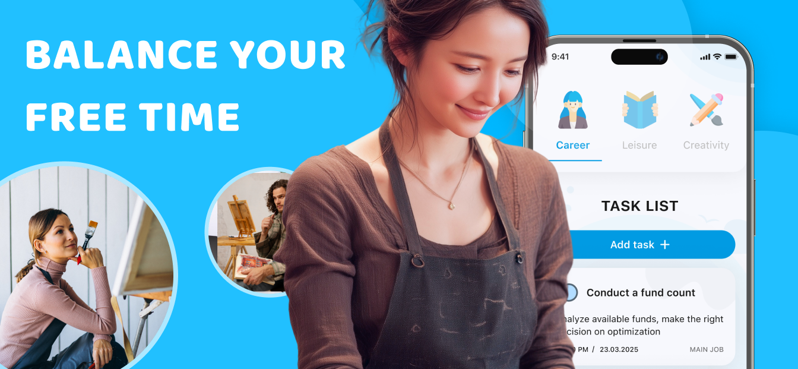
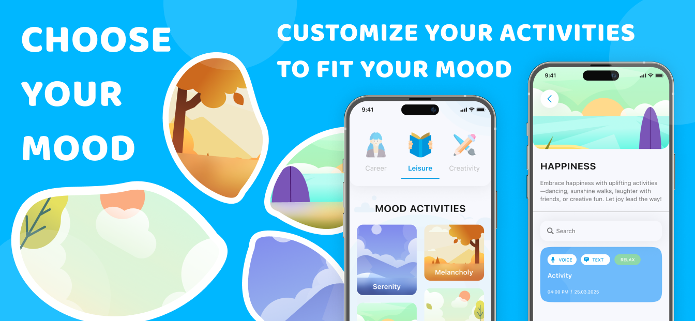

# FlowState: Work & Relax

**FlowState** is a Flutter app designed to balance productivity and rest. Switch between creative focus, mindful relaxation, and self-reflection. Plan tasks, track mood, write or record your thoughts — all in one calming workspace.



## 🛠️ Technologies

- **Flutter** and **Dart**
- **Provider** — state management
- **Hive** — local storage
- **Flutter ScreenUtil** — responsive layout
- **Custom components** — mood tracker, creativity timer, idea cards
- **Local assets** — icons, images, audio/text entries

## 📱 Screenshots






## 🚀 How to Run

1. Clone the repo
   ```sh
   git clone https://github.com/NMMustafina/flow_state_work_relax.git
   ```
2. Install all the packages by typing the following command
   ```sh
   flutter pub get
   ```
3. Run the App
